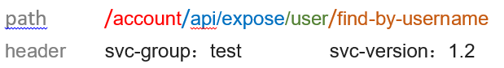

# 简述
将http请求，转为dubbo服务调用。通过搭配提供的注解，可完成以下功能：
1. 将请求体转为对应的实体入参
2. 可从请求头、请求参数中获取对应参数，并组装成实体
3. 可通过网关定制统一响应结构
4. 可指定dubbo方法的对应请求方式（GET/POST等）

# 项目结构描述
```
├─ dubb-provider：提供者案例
├─ proxy-dubbo-starter：dubbo代理的核心逻辑模块，其中包含对dubbo服务的处理、参数的解析、参数类型的生成以及服务的调用等
├─ proxy-dubbo-web-starter：dubbo网关工程，提供网关启动类和应用管理相关接口
```

# dubbo网关规则
> 继承网关基本规则的同时，又有自己的规则

## 请求方法
http的请求方法需要将注解 `xyz.me4cxy.proxy.annotation.ProxyMethod` 加载提供者需要暴露的方法上，如：
```java
public interface UserService {
    @ProxyMethod(method = ProxyMethodType.GET)
    User findByUsername(String username);
}
```
上面例子表明，`findByUsername` 在代理网关中需要使用GET请求才能进行调用

在部分代理网关不支持业务提供者存在相同方法名（重载）的情况时，也可以通过 **别名** 来进行映射，如：
```
@ProxyMethod(method = ProxyMethodType.GET)
@ProxyParam(index = 0, name = "user", paramType = ProxyParamType.PARAMETER)
void addUser(User user);

@ProxyMethod(method = ProxyMethodType.PUT, alias = "addUserByMap")
@ProxyParams(@ProxyParam(index = 0, name = "user"))
void addUser(Map<String, List<Integer>> user);
```

## 路径解析规则
在dubbo中，服务有以下关键信息：
```
1. application：应用
2. group：分组
3. version：版本
4. interface：具体服务接口
5. method(params...)：方法及参数
```
这些信息是进行dubbo泛化调用必须的参数，需要能够从http请求中提取到这些信息才能调用到具体的dubbo服务。

当前项目中，采用 path + header 的方式来提供这些内容，默认情况如下：
```
1. path：/<application>/<package>../<className>/<method>
2. header：svc-group、svc-version
```

最终将对应数据，拼合得到服务提供者和方法名：
```
interface：{packagePrefix}.{application}.{package}.{className}Service
    packagePrefix：包前缀，可通过配置修改
    application：应用名，注意会将“-”替换成“_”，例如应用名 opt-account，那么处理后会为 opt_account
    package：路径中的多个层级
    class
method：方法名称，推荐使用“-”分割风格，如方法名findByUsername，对应 find-by-username
```

*在 path 中，package 可以有多个层级，表示着包的多层级*

### 匹配案例


以下规则解析后的五大元素分别为：
```
1. application：account
2. group：test
3. version：1.2
4. interface：xyz.me4cxy.account.api.expose.UserService
5. method：findByUsername
```

这些信息由于只能确认到方法名称，并未确定参数，因此暂时还并不能作为最终调用dubbo服务的依据。

注意，对于 interface 信息中，还会进行数据的补充操作，如**包前缀**、**业务类**后缀。
**这些内容可以通过配置进行修改，详情可查看：**`xyz.me4cxy.proxy.dubbo.mapping.resolver.DubboProxyConfig`

## 参数处理
dubbo网关对于参数处理上，参考spring mvc的方式（部分地上采用spring mvc工具类），但由于dubbo元数据上报时不够细致，因此存在些许缺陷

### 方法匹配
由于业务提供者存在重载的情况，因此在加载完应用方法信息后，会将所有命中的方法列出，接着对方法进行匹配：
```
// 1.过滤出符合method以及命中参数最多的方法
List<ProxyMethodMetadata> matchResult = methodMatcher.match(methods, context);
log.info("当前请求 {} 匹配到方法：{}", context, matchResult);
if (matchResult.isEmpty()) {
    throw new ServiceMethodNotFoundException(serviceIdentify.getService() + "#" + methodName);
} else if (matchResult.size() > 1) {
    throw new NoUniqueServiceMethodException(serviceIdentify.getService() + "#" + methodName);
}
```

目前提供默认匹配规则较为简单，直接根据参数名称判断参数是否存在，最后取命中多的方法作为目标方法，如：
```
@ProxyMethod(method = ProxyMethodType.GET)
@ProxyParam(index = 0, name = "username")
User find(String username);

@ProxyMethod(method = ProxyMethodType.GET)
@ProxyParam(index = 0, name = "username")
@ProxyParam(index = 0, name = "age")
User find(String username, Integer age);

@ProxyMethod(method = ProxyMethodType.GET)
@ProxyParam(index = 0, name = "username")
@ProxyParam(index = 0, name = "city")
User find(String username, String addressCity);
```
假如参数传入：
```
username: jayin
age: 18
```
根据命中规则，能发现第二个方法命中2次，那么最终将匹配到方法```User find(String username, Integer age)```


### 数据装配
#### 普通参数传参
与spring mvc不同，由于在 `ProxyParam` 中指定了**参数名**，因此在数据装配时，会找到对应参数名称开头的参数，如：
```
@ProxyMethod(method = ProxyMethodType.GET)
@ProxyParam(index = 0, name = "user", paramType = ProxyParamType.PARAMETER)
void addUser(User user);
```
调用时，user参数需要增加对应的`user.`作为前缀（请求头参数也一样）：
```
user.username: 321
user.age: 12
user.birthday: 2023-12-01
```
如果属性是一个对象时，也是用相同的方式来传参：
```
user.address.city: 广州市
```

#### 普通数组传参
如果是数组传参时，直接参数名称系统即可
```
@ProxyMethod(method = ProxyMethodType.DELETE)
@ProxyParam(index = 0, name = "user")
void deleteAll(List<String> usernames);
```
参数传参方式：
```
user: jayin
user: test
```

#### 请求体传参
请求体传参时，相对简单，直接传入application/json即可
```
@ProxyMethod(method = ProxyMethodType.DELETE)
@ProxyParam(index = 0, name = "user", paramType = ProxyParamType.BODY)
void deleteAll(List<String> usernames);
```
body（application/json）：
```
["jayin", "test"]
```

#### Map参数
如果参数是Map时，网关能够直接将参数名前缀的参数都放入Map中，如
```
@ProxyMethod(method = ProxyMethodType.PUT)
@ProxyParams(@ProxyParam(index = 0, name = "user"))
void addUser(Map<String, String> user);
```
参数传参方式：
```
user.username: jayin
user.age: 18
```

### 缺陷
1.自定义实体类基础java类库时，无法有效识别父类，如：
```
public class CustomDate extends Date {
    ...
}
```
尽量在入参、方法中使用父类型（jdk定义的类型）：
```
public class User implements Serializable {
    // private CustomDate birthday; // 不能这样，会识别不到
    private Date birthday;
}
```
如果某个类需要指定特殊的实例对象，可以在 `super-type.properties` 中指定，在初始化时将会找到对应类型进行创建实例
```
java.util.List = java.util.ArrayList
java.util.Collection = java.util.ArrayList
java.util.Map = java.util.HashMap
java.util.Set = java.util.HashSet
```

2.自定义实体类中，无法识别到泛型，例如：
```
// 无法识别到 content 的泛型信息
public class QwMessage<T extends QwMessageContent> {
    private T content;
}
```

3.对于参数是数组、集合的方法，默认仅支持简单对象，如String、Integer等。如果需要实体类，则请自定义spring的converter，
并注册到ConversionService中（因为参数处理是基于ConversionService实现的）
```
@ProxyMethod(method = ProxyMethodType.DELETE)
@ProxyParam(index = 0, name = "user", paramType = ProxyParamType.BODY)
void deleteAll(List<String> usernames);
```

## 配置描述
```
xyz:
  me4cxy:
    rpc-proxy:
      dubbo:
        package-prefix:  # 包前缀，会拼接到最终的包名称去，默认空字符串
        default-version:  # 如果未传 version 时的默认值，默认空字符串
        default-group:  # 如果未传 group 时的默认值，默认空字符串
        service-class-suffix: Service # dubbo提供者业务接口后缀
        group-header-name: svc-group # 请求头中group的名称
        version-header-name: svc-version # 请求头中version的名称
        timeout-milli: 20000 # dubbo调用超时时间，单位毫秒
        # 路径规则正则表达式，会根据正则分组情况，匹配到对应的值
        path-rule-regex: /(?<application>${seg})/(?<package>${mseg})/(?<className>${seg})/(?<method>${seg})
```